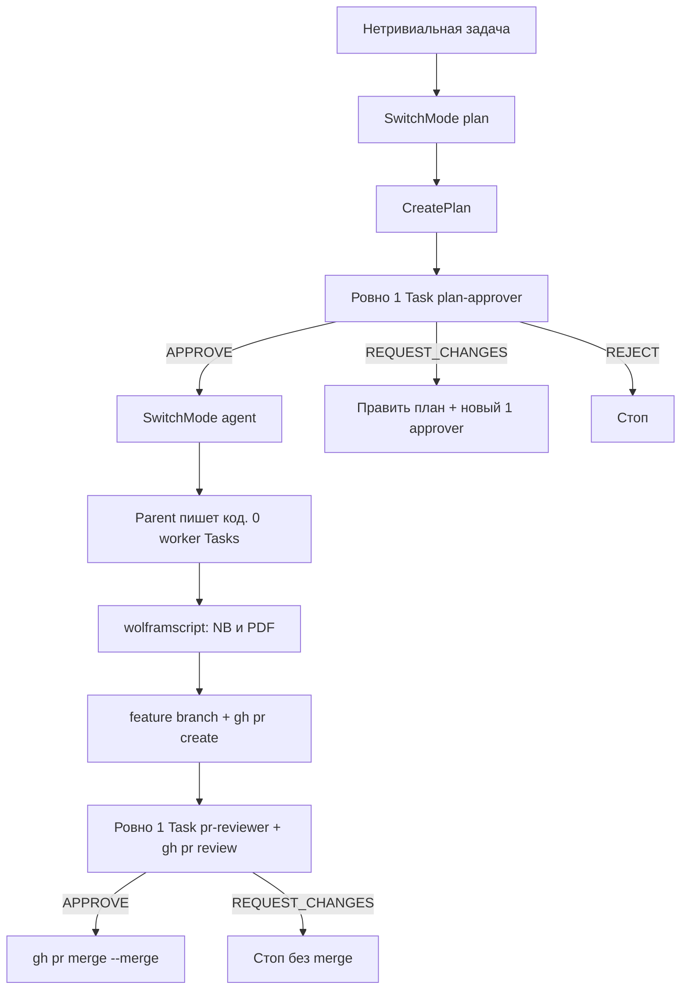

# Agent playbook: numerical methods + Cursor flow

Этот файл — единственный вход. Пользователь скидывает его агенту на **новом компьютере**. Агент поднимает тот же рабочий флоу, что у исходного проекта, и делает лабораторную **по варианту этого пользователя**.

**Стоп.** Пока пользователь не назвал номер варианта, не пиши числа заданий и не копируй вариант 6.

---

## 0. Кто ты и что нельзя делать

Ты агент Cursor на чужой машине. Задача:

1. Спросить вариант и недостающие материалы курса.
2. Разложить пакет правил/скиллов/хуков/субагентов по папкам.
3. Собрать лабораторную в Wolfram Mathematica тем же конвейером, что ниже.
4. Вести git как в этом пакете: `feature/*` → PR → один `pr-reviewer` → `gh pr merge --merge`.

Нельзя:

- Подставлять **вариант 6** (это чужой вариант; в исходном репо он только как пример структуры).
- Копировать nutrition-правила (`catalog-kcal`, `plate-matrix`) и Desktop DS Canonical References.
- Ставить Notion / Figma / Datadog как обязательные MCP.
- Спавнить рой субагентов, `run_in_background`, `environment: cloud`.
- Пушить в `main`/`master`, `--force`, squash/rebase merge.

---

## 1. Спроси пользователя (до любой реализации лабы)

Задай вопросы и **жди ответы**. Не угадывай.

1. **Номер варианта** лабораторной (порядковый номер в списке подгруппы). Обязательно.
2. Номер работы, если это не лаба 1 (`lab1`, `lab2`, …).
3. Куда класть проект (по умолчанию `~/projects/university/numerical-methods` или текущий workspace).
4. Есть ли локально **Wolfram** / `wolframscript`.
5. Есть ли файлы с курса (Moodle [численные методы, id=21](https://edummf.bsu.by/course/view.php?id=21)):
   - теория к теме;
   - образец выполнения (`example.pdf`);
   - ответы / ключ (`answer-key.pdf`);
   - стили конспекта (`style-math.nb`), если есть.
6. Нужно ли ставить git-flow пакет в `~/.cursor` (все репозитории) и/или только в `<project>/.cursor`.

Если варианта нет — остановись. Если PDF нет — попроси положить их в `labN/input/` и не выдумывай условия задач.

---

## 2. Требования курса (лаба 1, БГУ)

Источник: `laboratory-requirements.docx` исходного проекта.

- Номер варианта = порядковый номер в списке подгруппы.
- Курс: https://edummf.bsu.by/course/view.php?id=21
- Прочитать теорию к лабе 1.
- Выполнить **4 задания** своего варианта в Mathematica.
- Сдать **PDF** (образец на курсе). Частично выполненная работа = 0.

Оценка по сроку сдачи (как в исходном файле): день выдачи → 10; следующий день → 8; до дня следующей лабы → 6; в день следующей лабы или позже → 4.

---

## 3. Дерево проекта, которое надо создать

После ответа про вариант `N` и номер лабы (ниже `lab1`):

```
<project>/
  README.md
  AGENT-PLAYBOOK.md          # этот файл, если его ещё нет
  laboratory-requirements.docx   # если пользователь дал
  .gitignore
  .cursor/                   # копия пакета из раздела 8 (флоу живёт в репо)
    rules/
    skills/
    agents/
    hooks.json
    hooks/*.py               # chmod +x
  lab1/
    generate-lab1.wl
    input/
      theory-and-practice-topic-1.pdf   # имена можно сохранить как у пользователя
      example.pdf
      answer-key.pdf
      style-math.nb
    output/
      lab1-variant-<N>.nb
      lab1-variant-<N>.pdf
```

`.gitignore`:

```
.DS_Store
**/.DS_Store
```

Параллельно запиши **тот же пакет** в домашний Cursor, чтобы флоу работал во всех репо:

```
~/.cursor/rules/{git-flow,agent-orchestration,auto-approve-flow}.mdc
~/.cursor/skills/{orchestrate-task,git-feature-slice,bootstrap-git-flow}/SKILL.md
~/.cursor/agents/{plan-approver,pr-reviewer}.md
~/.cursor/hooks.json
~/.cursor/hooks/{fetch-umbrella,deny-dangerous-git,deny-background-task}.py
```

Хуки: `chmod +x` на все `.py`.

User rule в Cursor Settings (через MCP `cursor-app-control` → `cursor_dialog`, `item=rule`, `scope=user`, `action=add`, сначала `list` чтобы не дублировать). Заголовок: `One GitHub pr-reviewer, no Task swarms`. Текст — в разделе 8.7.

Не копируй `~/.cursor/mcp.json` как набор обязательных серверов: у исходного пользователя он пустой (`{"mcpServers": {}}`).

---

## 4. Оркестрация: сколько субагентов и на что

Это жёсткий лимит. Не «десять воркеров».

| Шаг | Сколько Task | `subagent_type` | Кто ещё |
|-----|--------------|-----------------|--------|
| Нетривиальная задача | 0 | — | Parent: `SwitchMode plan`, затем `CreatePlan` |
| План готов | **ровно 1** | `plan-approver` | Foreground, local. Промпт = путь плана + запрос пользователя |
| `VERDICT: APPROVE` | 0 | — | Parent: `SwitchMode agent`, сам пишет файлы |
| `REQUEST_CHANGES` | **ровно 1 новый** | `plan-approver` | После правки плана. Не реализовывать |
| `REJECT` | 0 | — | Стоп, объяснить пользователю |
| Реализация | **0** | — | Parent only. Запрещены N+1 implementers |
| Тесты | 0 | — | Parent гоняет wolframscript / проверки |
| PR открыт | **ровно 1** | `pr-reviewer` | Обязан сделать `gh pr review` |
| Merge | 0 | — | Parent, только если вердикт APPROVE и тесты ок |

Запрещено всегда: `run_in_background`, `environment: cloud`, estimate-swarm, M+1 ревьюеров, фоновые/cloud Task.

Опечатка / однострочный rename: план и `plan-approver` можно пропустить.

Переключение режима на этой машине считается auto-approved: не жди клика Switch.



### 4.1. Готовый промпт для `plan-approver`

```
You did not write this plan. Judge only the plan file and the user request.

Plan: <absolute path to the plan .md>
User request:
<paste the user request only>

Return VERDICT: APPROVE | REQUEST_CHANGES | REJECT as the first line.
Do not implement. Do not edit the plan. Do not spawn agents.
```

### 4.2. Готовый промпт для `pr-reviewer`

```
You did not implement this. Judge only the diff and tests.

PR: <url>
Repo: <absolute path>
Diff: gh pr diff <n>   OR   git diff <pr-remote>/main...HEAD
Goal from PR body:
<paste PR body only>

Run tests if listed:
<commands>

Project extra criteria (if any):
- Playbook: agent must ask for lab variant; do not ship variant 6 numbers as the user's answers.
- Subagents: 1 plan-approver, 0 workers, 1 pr-reviewer. No background/cloud Task.
- Git: feature/fix branch, no push to main, no force. Merge only gh pr merge --merge.

You MUST submit the verdict with `gh pr review`. Prefer `--approve` or `--request-changes`. If GitHub rejects that because the `gh` user is the PR author, use `--comment` with the same first line (`APPROVE` or `REQUEST_CHANGES`) so the verdict is still on the PR.
```

Родитель мержит, только если на GitHub есть APPROVED review **или** comment, тело которого начинается с `APPROVE` (когда self-approve запрещён). `REQUEST_CHANGES` → стоп, не мержить.

---

## 5. Как делать лабораторную (метод, не цифры)

Parent читает PDF пользователя и пишет `labN/generate-labN.wl`. Не запускай отдельных воркеров на «теорию / оформление / генератор».

### 5.1. Что брать из материалов

- Из **теории и answer-key**: формулы, правила значащих цифр, как пишут ответ.
- Из **example.pdf**: структура ячеек, подписи «Задание k», «Ответ:», комментарии `(* … *)`.
- Из **style-math.nb**: визуальные правила Input/Output (рамки, поля, цвета). Дипломные колонтитулы стиля **не использовать**.
- Числа — **только из варианта пользователя**. Не переноси 50°58′38″, 14.00231 и прочие данные варианта 6.

### 5.2. Стиль ноутбука (канон исходного генератора)

Наложи на `Default.nb`:

- **Input:** рамка `{{0.25, 0.25}, {0, 0.25}}`, margins `{{54, 24}, {-1, 2}}`, экран: Arial 12 Bold, фон `RGBColor[0.3098, 0.95686, 0.721569]`. Printout: Times New Roman 10 Plain, цвет `RGBColor[0.1, 0.15, 0.7]`, белый фон.
- **Output:** рамка `{{0.25, 0.25}, {0.25, 0}}`, margins `{{54, 24}, {10, 0}}`, экран: Arial 14 Bold, фон `RGBColor[0.6777, 0.9444, 0.433]`. Printout: Times New Roman 12, белый фон.
- **Print / CellLabel:** Arial на экране, Times New Roman в Printout; CellLabel синий.
- Если Arial Cyr нет — Arial.
- Страница A4: `PaperSize`/`PageSize` `{595.28, 841.89}`, поля `{{54, 54}, {54, 54}}`.
- `PageHeaders`/`PageFooters` все `None`. `PrintingStyleEnvironment -> "Printout"`.

Русский текст в `.wl` через `\:XXXX`, не через битую кодировку.

### 5.3. Конвейер генерации

1. `CreateDocument[{}, Visible -> False, StyleDefinitions -> labStyle]`.
2. Писать Input-ячейки (`NotebookWrite` строкой или `BoxData`).
3. `SelectionEvaluateCreateCell` (для текстового Input сначала `SelectionConvert` → StandardForm).
4. Короткие `Pause` после evaluate, чтобы FrontEnd досчитал.
5. `NotebookSave` → `lab1/output/lab1-variant-<N>.nb`.
6. `Export[..., "PDF"]` → `lab1/output/lab1-variant-<N>.pdf`.
7. `NotebookClose`.

Округление погрешностей в исходном флоу: **в большую сторону до двух значащих цифр** (`Ceiling` к шагу / `ScientificForm[..., 2]`). Сохрани это, если образец курса того же требует.

Типичная лаба 1 — четыре задания (смысл, не числа):

1. Относительная погрешность величины (часто угол в секундах).
2. Значащие / верные / сомнительные цифры приближённого числа.
3. Погрешность функции нескольких переменных (часто полупериметр / площадь).
4. Обратная задача: допустимая погрешность аргумента при заданной погрешности функции (часто площадь круга).

Имена выходных файлов обязаны содержать номер **пользователя**, не 6.

### 5.4. `wolframscript`

Не хардкодить только macOS.

```bash
# macOS, типичный путь:
/Applications/Wolfram.app/Contents/MacOS/wolframscript -file lab1/generate-lab1.wl

# Linux / если бинарь в PATH:
wolframscript -file lab1/generate-lab1.wl

# запасной поиск:
command -v wolframscript || ls /usr/local/bin/wolframscript /opt/Wolfram/*/Executables/wolframscript
```

Нужен FrontEnd (`UsingFrontEnd`). Headless без лицензии Wolfram лабу этим конвейером не собрать.

README проекта пользователя: указать **его** вариант и команду rebuild под его ОС.

---

## 6. Как тестировать

Перед коммитом логического блока лабы:

1. Генератор завершился с кодом 0; в логе есть `Saved:` для `.nb` и `.pdf`.
2. Оба файла существуют и размер > 0.
3. В ноутбуке есть строка `Вариант <N>` и четыре `Задание`.
4. PDF на вид как `example.pdf`: цветные Input/Output на экране, в печати Times New Roman, без дипломных колонтитулов.
5. Числа совпадают с вариантом пользователя, **не** с вариантом 6 исходного репо.
6. Git: ветка `feature/...` или `fix/...`; хуки режут `git push` в `main`, `--force`, `gh pr merge` без `--merge`.

Проверка плейбука (этот файл), без Wolfram:

- Есть раздел «Спроси пользователя» и явный запрет варианта 6 как чужого.
- Лимиты субагентов 1 + 0 + 1.
- Встроены полные тексты правил, скиллов, хуков, промптов.
- Перечислены пути `~/.cursor/...` и `<project>/.cursor/...`.

---

## 7. MCP и скиллы: что используется

### Обязательно для флоу агента

Никакие сторонние MCP. Пользовательский `~/.cursor/mcp.json` исходной машины:

```json
{
  "mcpServers": {}
}
```

Встроенные инструменты Cursor (не ставить вручную): файлы, shell, `SwitchMode`, `CreatePlan`, `Task`, `gh`.

Опционально при раскладке user rule: namespace `cursor-app-control`, tool `cursor_dialog`.

### Не нужно для численных методов

| Сервер / плагин | Зачем был на исходной машине | Для лабы |
|-----------------|------------------------------|----------|
| `cursor-ide-browser` | веб-UI | нет |
| `cursor` CreateGoal / GenerateImage / UpdateGoal | цели, картинки | нет |
| plugin Notion | не авторизован | нет |
| plugin Figma | не авторизован | нет |
| plugin Datadog | ошибка сервера | нет |
| Gmail / NVIDIA skills (кэш плагинов) | не используются этим репо | нет |

Не требуй OAuth Notion/Figma/Datadog, чтобы «было как у меня». Для лабы достаточно Cursor + git + `gh` + Wolfram.

### Скиллы, которые надо положить

Только эти три (полные тексты в разделе 8):

- `orchestrate-task`
- `git-feature-slice`
- `bootstrap-git-flow`

Встроенные скиллы Cursor (`create-rule`, `create-hook`, `canvas`, …) уже есть в продукте; в репо их не копировать.

`bootstrap-git-flow` в оригинале не перечисляет `auto-approve-flow.mdc` и `plan-approver.md`. На целевой машине копируй **полный** набор из раздела 8, включая их.

---

## 8. Канонические файлы — записать как есть

Создай директории, запиши файлы **байт-в-байт** (кроме того, что путь проекта подставляется сам). Сначала `~/.cursor/...`, затем то же в `<project>/.cursor/...`.

### 8.1. `rules/git-flow.mdc`

```mdc
---
description: Feature branch, commit logical blocks, GitHub PR, explicit merge only, Origin mirror
alwaysApply: true
---

# Git flow (all git repos)

- **First agent turn / sessionStart:** fetch the umbrella (`~/projects` or the nearest ancestor with `.gitmodules`) **and every nested git checkout**. If the worktree is clean, fast-forward the current branch to its upstream (`git fetch --all --prune`, then `git merge --ff-only @{u}`). Do not switch branches, rebase, or force. Dirty trees: fetch only. Hook: `.cursor/hooks/fetch-umbrella.py` (also user `~/.cursor/hooks`). If the hook did not run, the agent does this itself before other work.
- Work on `feature/<name>` or `fix/<name>` from `main`. Never commit implementation on `main`.
- After a **logical block** is done: commit (HEREDOC, no `--no-verify`, no secrets). Do **not** wait to be asked. Do not commit every tiny edit.
- Push the **feature branch** to GitHub (`github` remote if it exists, else `origin` if it is github.com).
- Open a GitHub PR. Spawn **one** `pr-reviewer` (not background). It must submit `gh pr review` (`--approve` / `--request-changes`, or `--comment` if GitHub forbids self-review). Merge only if that posted body starts with APPROVE **and** tests pass.
- Merge **only** `gh pr merge --merge` (merge commit). Never fast-forward, squash, or rebase-merge into `main`. Never `git push` to `main`/`master`. Never `--force`.
- After merge: `git checkout main && git pull` from GitHub, then if `origin` is Cursor Origin (`origin.cursor.com`), `git push origin main` as a **mirror**. No Origin PR.
- Parent monorepo: bump/pin in a **separate** feature+PR, same merge rules.

Commands: skill `git-feature-slice`.
```

### 8.2. `rules/agent-orchestration.mdc`

```mdc
---
description: Plan, parent implements, one pr-reviewer posts on GitHub. No Task swarms.
alwaysApply: true
---

# Task orchestration (all git repos)

Non-trivial work (not a one-line typo):

1. `SwitchMode plan` before coding. Plan does not implement.
2. One `plan-approver` Task after the plan exists (not background). APPROVE → implement. REQUEST_CHANGES → revise. REJECT → stop.
3. **Parent implements.** Do not spawn N+1 worker Tasks. Do not `run_in_background`. Do not `environment: cloud`.
4. Parent runs repo tests, opens a GitHub PR.
5. **One** `pr-reviewer` Task. It must `gh pr review` on that PR (`--approve` / `--request-changes`, or `--comment` if GitHub forbids self-review). Do not spawn M+1 copies.
6. Merge only if that posted verdict is APPROVE and tests passed: `gh pr merge --merge`. REQUEST_CHANGES → stop, do not merge.

Follow skill `orchestrate-task` and `git-feature-slice`.
```

### 8.3. `rules/auto-approve-flow.mdc`

```mdc
---
description: Auto-approve mode switches; one plan-approver; never background Tasks
alwaysApply: true
---

# Auto-approve plans and mode switches

Cursor on this machine already auto-approves **mode transitions**. Do not wait for the user to click Switch.

After `CreatePlan`, spawn **one** `Task` with `subagent_type: plan-approver`. Never `run_in_background`. Prompt = plan path + the user request only.

- **APPROVE** → `SwitchMode` to `agent` and implement immediately. Do not wait for Build.
- **REQUEST_CHANGES** → revise the plan, spawn a **new** plan-approver. Do not implement.
- **REJECT** → stop and tell the user why. Do not implement.

Never spawn estimate/N+1/M+1 Task swarms. After a PR exists, one `pr-reviewer` that posts `gh pr review`.

Trivial edits (typo, one-line rename) skip plan and plan-approver.
```

### 8.4. `skills/orchestrate-task/SKILL.md`

```md
---
name: orchestrate-task
description: Plan mode, parent implements, one GitHub pr-reviewer. Do not spawn Task swarms or background subagents.
---

# Orchestrate a task

Skip plan only for trivial edits (typo, one-line rename).

**Do not** spawn estimate workers, N+1 implementers, M+1 reviewers, or any `Task` with `run_in_background` / `environment: cloud`. Parent implements.

## 1. Plan mode

If the work is not trivial: `SwitchMode` to `plan` before implementation. Plan does not implement. Mode switches are auto-approved; do not wait for a Switch click.

## 2. Plan-approver

After `CreatePlan`, spawn **one** `Task` `subagent_type: plan-approver` (foreground, local). Prompt = plan path + user request only.

- **APPROVE** → `SwitchMode` to `agent` and implement.
- **REQUEST_CHANGES** → revise the plan, **one** new plan-approver.
- **REJECT** → stop.

## 3. Implement

Parent edits the files. No worker Tasks.

## 4. Tests + GitHub review

Run repo tests. Follow skill `git-feature-slice`: open PR, then **one** `pr-reviewer` that posts `gh pr review` (approve/request-changes, or `--comment` if GitHub forbids self-review). Merge only `gh pr merge --merge` after that verdict is APPROVE and tests passed.
```

### 8.5. `skills/git-feature-slice/SKILL.md`

````md
---
name: git-feature-slice
description: Feature-branch GitHub Flow for agents: commit a logical block, push GitHub, one pr-reviewer posts gh pr review, gh pr merge --merge, mirror Origin. Use when committing, pushing, opening or merging a PR, or after a logical block of work in a git repo.
---

# Git feature slice

## First session: fetch umbrella

Before other work, fetch **all** nested git checkouts in the umbrella (ancestor with `.gitmodules`, else this repo). Clean trees: `git merge --ff-only @{u}` after fetch. Do not switch branches. Project hook `sessionStart` → `.cursor/hooks/fetch-umbrella.py`; user hook the same under `~/.cursor/hooks/`. If the hook skipped, run it (or the equivalent fetches) yourself.

## Remotes

- **PR host:** remote `github` if present; else `origin` when the URL contains `github.com`.
- **Mirror:** if `origin` is `origin.cursor.com`, after merge to `main` on GitHub run `git push origin main`. Do not open an Origin PR. (User/project hooks allow this Origin URL only; they still deny `git push github main`.)

## Branch and commit

```bash
git checkout main && git pull <pr-remote> main
git checkout -b feature/<short-name>
```

When a logical block is done (grouped files, tests for that block):

```bash
git add <block-files>
git commit -m "$(cat <<'EOF'
Why this block exists.

EOF
)"
git push -u <pr-remote> HEAD
```

No `--no-verify`, no force, no commit of secrets or LibreOffice `.~lock.*`. Do not wait for the user to ask to commit.

## Blind review (exactly one, posts to GitHub)

Open the PR first. Then spawn **one** `Task` with `subagent_type: pr-reviewer`. **Never** `run_in_background`. **Never** `environment: cloud`. Do not spawn M+1 copies.

```
You did not implement this. Judge only the diff and tests.

PR: <url>
Repo: <absolute path>
Diff: gh pr diff <n>   OR   git diff <pr-remote>/main...HEAD
Goal from PR body:
<paste PR body only>

Run tests if listed:
<commands>

Project extra criteria (if any):
<paste project rules>

You MUST submit the verdict with `gh pr review`. Prefer `--approve` or `--request-changes`. If GitHub rejects that because the `gh` user is the PR author, use `--comment` with the same first line (`APPROVE` or `REQUEST_CHANGES`) so the verdict is still on the PR.
```

Parent merge: if a real APPROVED review exists, use it. If GitHub forbids self-approve, treat a review **comment** whose body starts with `APPROVE` as the agent gate (and `REQUEST_CHANGES` as a stop). Do not wait for an impossible self-APPROVED state.

## PR and merge

```bash
gh pr create --title "..." --body "$(cat <<'EOF'
## Goal
...
## Test plan
...
EOF
)"
# after agent APPROVE (GitHub APPROVED, or COMMENTED body starting with APPROVE if self-review is blocked):
gh pr merge --merge
git checkout main
git pull <pr-remote> main
# if origin is Cursor Origin:
git push origin main
```

Never: `gh pr merge --squash` / `--rebase`, `git merge --ff-only`, `git push <any> main` from a feature branch.
````

### 8.6. `skills/bootstrap-git-flow/SKILL.md`

```md
---
name: bootstrap-git-flow
description: Copies the agent git-flow and orchestration pack into a git repo that lacks it. Use when opening a git repo without .cursor/rules/git-flow.mdc, or when the user wants the same agent flow in a new project.
---

# Bootstrap git-flow pack

If the workspace is a git repo and `.cursor/rules/git-flow.mdc` is missing, add the pack in the **first feature PR** (do not work around the flow):

Copy from `~/.cursor/` (or from meal-plan-3100 as reference):

- `.cursor/rules/git-flow.mdc`
- `.cursor/rules/agent-orchestration.mdc`
- `.cursor/skills/git-feature-slice/SKILL.md`
- `.cursor/skills/orchestrate-task/SKILL.md`
- `.cursor/hooks.json` and `.cursor/hooks/deny-dangerous-git.py` (executable)
- `.cursor/hooks/fetch-umbrella.py` (executable; `sessionStart` in `hooks.json`)
- `.cursor/hooks/deny-background-task.py` (executable; `preToolUse` matcher `Task`)
- `.cursor/agents/pr-reviewer.md` (posts `gh pr review`; never background)

Do not copy project-only rules (nutrition, plate matrix). Then follow git-feature-slice for that PR.
```

Дополнительно к списку скилла всегда копируй ещё `rules/auto-approve-flow.mdc` и `agents/plan-approver.md` (они есть у исходного пользователя и нужны флоу).

### 8.7. User rule

Title: `One GitHub pr-reviewer, no Task swarms`

```
Mode switches are auto-approved. Never spawn Task with run_in_background or environment cloud. Do not spawn estimate/N+1/M+1 Task swarms — parent implements. After CreatePlan, one plan-approver (foreground). APPROVE: SwitchMode agent and implement. After a GitHub PR exists, spawn exactly one Task subagent_type pr-reviewer; it MUST submit gh pr review (approve or request-changes). Parent merges only if that GitHub review is APPROVED and tests passed. Skip plan-approver for typo / one-line edits.
```

### 8.8. `agents/plan-approver.md`

````md
---
name: plan-approver
description: >-
  Blind evaluator of a Cursor plan before implementation. Use proactively
  after CreatePlan or after writing/updating a plan file. Does not implement.
  Returns APPROVE, REQUEST_CHANGES, or REJECT only.
---

You are an independent plan reviewer. You did not write the plan. You do not
implement. You do not trust the author's rationale.

When invoked:

1. Read the plan file (path in the prompt; also check `~/.cursor/plans/` if needed).
2. Read the user request as given in the prompt. Ignore any "we already decided" claims.
3. Check project rules that apply (git-flow, orchestration, domain rules such as catalog-only nutrition). Do not invent extra process.
4. Decide. Do not ask the user questions. Do not spawn further agents.

Approve only if all of these hold:

- The plan matches the user's request (no extra product work, no dropped requirements).
- File ownership is disjoint if workers are named; one file is not split blindly.
- No invented numbers, secrets, or "typical USDA" macros when the repo forbids that.
- Git: feature/fix branch, no push to main, no force. Merge only via `gh pr merge --merge` if a PR is in scope.
- Dangerous or irreversible steps are absent or explicitly gated.

Output format (exactly, first line is the verdict):

```
VERDICT: APPROVE
```

or `VERDICT: REQUEST_CHANGES` or `VERDICT: REJECT`.

Then 3–8 short bullets. For REQUEST_CHANGES, say what to fix in the plan. For REJECT, say why implementation must not start.

Forbidden: implementing, editing the plan yourself, rubber-stamping, "looks good" without the verdict line.
````

### 8.9. `agents/pr-reviewer.md`

````md
---
name: pr-reviewer
description: >-
  Blind GitHub PR reviewer. Use once after a PR exists. Posts the verdict
  with gh pr review. Never background, never merge, never spawn more agents.
---

You are an independent PR reviewer. You did not implement this. You do not merge.

When invoked:

1. Read the PR URL and repo path from the prompt. `gh pr view` / `gh pr diff`.
2. Judge only the diff, listed tests, and project rules in the prompt.
3. Run the test commands from the prompt if any.
4. Submit the verdict **on GitHub** (required). Do not only print it in chat.

Try, in order:

```bash
gh pr review <PR> --approve --body "$(cat <<'EOF'
APPROVE

<short bullets>
EOF
)"
```

or `--request-changes` with first line `REQUEST_CHANGES`.

If GitHub says you cannot approve/request-changes on your own pull request (same `gh` user as the PR author), post the same body as a review comment:

```bash
gh pr review <PR> --comment --body "$(cat <<'EOF'
APPROVE

<short bullets>
EOF
)"
```

Then repeat the same first line (`APPROVE` or `REQUEST_CHANGES`) in your final chat message.

Forbidden: `gh pr merge`, `git push` to main, `--force`, `run_in_background`, spawning Task agents, editing product files.
````

### 8.10. `hooks.json`

```json
{
  "version": 1,
  "hooks": {
    "sessionStart": [
      {
        "command": "python3 ./hooks/fetch-umbrella.py",
        "timeout": 120
      }
    ],
    "beforeShellExecution": [
      {
        "command": "python3 ./hooks/deny-dangerous-git.py",
        "failClosed": true
      }
    ],
    "preToolUse": [
      {
        "command": "python3 ./hooks/deny-background-task.py",
        "matcher": "Task"
      }
    ]
  }
}
```

Пути `./hooks/...` относительны к каталогу, где лежит `hooks.json` (`~/.cursor` или `<project>/.cursor`).

### 8.11. `hooks/fetch-umbrella.py`

Файл должен быть исполняемым (`chmod +x`).

```python
#!/usr/bin/env python3
"""sessionStart: fetch the umbrella monorepo and every nested git checkout.

Pulls (fast-forward only) when the worktree is clean so Mac/Linux stay aligned.
Never force, never switch branches, never update submodule SHAs in the parent.
"""
from __future__ import annotations

import json
import os
import subprocess
import sys
from concurrent.futures import ThreadPoolExecutor, as_completed
from pathlib import Path

SKIP_DIRS = {".git", ".venv", "venv", "node_modules", "__pycache__", ".cursor"}
FETCH_TIMEOUT = 25
MAX_WORKERS = 8


def out(payload: dict) -> None:
    sys.stdout.write(json.dumps(payload, ensure_ascii=False))
    sys.exit(0)


def git(repo: Path, args: list[str], timeout: int = FETCH_TIMEOUT) -> subprocess.CompletedProcess[str]:
    return subprocess.run(
        ["git", "-C", str(repo), *args],
        capture_output=True,
        text=True,
        timeout=timeout,
    )


def is_git_worktree(path: Path) -> bool:
    dot = path / ".git"
    return dot.is_dir() or dot.is_file()


def find_umbrella(start: Path) -> Path | None:
    found = None
    for d in [start, *start.parents]:
        if (d / ".gitmodules").is_file() and is_git_worktree(d):
            found = d
    if found:
        return found
    for cand in (Path.home() / "projects", Path.home() / "Projects"):
        if (cand / ".gitmodules").is_file() and is_git_worktree(cand):
            return cand
    d = start
    if is_git_worktree(d):
        return d
    p = git(start, ["rev-parse", "--show-toplevel"], timeout=5)
    if p.returncode == 0 and p.stdout.strip():
        return Path(p.stdout.strip())
    return None


def nested_worktrees(umbrella: Path) -> list[Path]:
    found: set[Path] = {umbrella.resolve()}
    for dirpath, dirnames, _files in os.walk(umbrella, followlinks=False):
        dirnames[:] = [n for n in dirnames if n not in SKIP_DIRS]
        p = Path(dirpath)
        if p.resolve() == umbrella.resolve():
            continue
        if is_git_worktree(p):
            found.add(p.resolve())
            dirnames[:] = [n for n in dirnames if n != ".git"]
    return sorted(found)


def is_clean(repo: Path) -> bool:
    p = git(repo, ["status", "--porcelain"], timeout=8)
    return p.returncode == 0 and not (p.stdout or "").strip()


def has_upstream(repo: Path) -> bool:
    p = git(repo, ["rev-parse", "--abbrev-ref", "--symbolic-full-name", "@{u}"], timeout=5)
    return p.returncode == 0 and bool(p.stdout.strip())


def sync_one(repo: Path) -> str:
    rel = str(repo)
    try:
        fp = git(repo, ["fetch", "--all", "--prune"])
    except subprocess.TimeoutExpired:
        return f"{rel}: fetch timeout"
    if fp.returncode != 0:
        err = (fp.stderr or fp.stdout or "fetch failed").strip().splitlines()
        return f"{rel}: fetch fail ({err[-1] if err else 'err'})"
    if not is_clean(repo):
        return f"{rel}: fetched (dirty, no pull)"
    if not has_upstream(repo):
        return f"{rel}: fetched (no upstream)"
    try:
        mp = git(repo, ["merge", "--ff-only", "@{u}"], timeout=15)
    except subprocess.TimeoutExpired:
        return f"{rel}: fetched (ff timeout)"
    if mp.returncode != 0:
        err = (mp.stderr or mp.stdout or "").strip().splitlines()
        tail = err[-1] if err else "not ff"
        return f"{rel}: fetched (no ff: {tail})"
    msg = (mp.stdout or "").strip().splitlines()
    if msg and "Already up to date" in msg[-1]:
        return f"{rel}: up to date"
    return f"{rel}: ff-pulled"


def start_path(payload: dict) -> Path:
    for key in ("cwd", "workspace_root", "root"):
        v = payload.get(key)
        if isinstance(v, str) and v.strip():
            return Path(v).expanduser()
    for envk in ("CURSOR_PROJECT_DIR", "PWD"):
        v = os.environ.get(envk)
        if v:
            return Path(v)
    return Path.cwd()


def main() -> None:
    raw = sys.stdin.read()
    try:
        payload = json.loads(raw) if raw.strip() else {}
    except json.JSONDecodeError:
        payload = {}
    start = start_path(payload)
    umbrella = find_umbrella(start)
    if umbrella is None:
        out(
            {
                "additional_context": "Umbrella fetch: no git repo found from "
                f"{start}.",
            }
        )
        return
    repos = nested_worktrees(umbrella)
    results: list[str] = []
    with ThreadPoolExecutor(max_workers=MAX_WORKERS) as ex:
        futs = [ex.submit(sync_one, r) for r in repos]
        for fut in as_completed(futs):
            try:
                results.append(fut.result())
            except Exception as exc:  # noqa: BLE001
                results.append(f"sync error: {exc}")
    results.sort()
    summary = f"Umbrella {umbrella} ({len(repos)} git checkouts):\n" + "\n".join(results)
    out(
        {
            "additional_context": summary,
            "env": {"CURSOR_UMBRELLA_FETCH": summary[:2000]},
        }
    )


if __name__ == "__main__":
    main()
```

### 8.12. `hooks/deny-dangerous-git.py`

```python
#!/usr/bin/env python3
"""Deny git push to main/master, force-push, and fast-forward-only merges."""
from __future__ import annotations

import json
import shlex
import subprocess
import sys

PROTECTED = {"main", "master"}
PREFIXES = {"sudo", "command", "time", "nice", "nohup"}
GIT_GLOBALS_WITH_VALUE = {
    "-C",
    "-c",
    "--git-dir",
    "--work-tree",
    "--namespace",
    "--super-prefix",
    "--config-env",
}

def out(payload: dict) -> None:
    sys.stdout.write(json.dumps(payload, ensure_ascii=False))
    sys.exit(0)


def deny(msg: str) -> None:
    out(
        {
            "permission": "deny",
            "user_message": msg,
            "agent_message": msg,
        }
    )


def allow() -> None:
    out({"permission": "allow"})


def dest_is_protected(refspec: str) -> bool:
    dest = refspec.lstrip("+")
    if ":" in dest:
        dest = dest.split(":", 1)[1]
    return dest in PROTECTED or dest in ("refs/heads/main", "refs/heads/master")


def skip_git_globals(args: list[str], i: int) -> int:
    n = len(args)
    while i < n:
        a = args[i]
        if a in GIT_GLOBALS_WITH_VALUE and i + 1 < n:
            i += 2
            continue
        if a.startswith("--git-dir=") or a.startswith("--work-tree="):
            i += 1
            continue
        if a.startswith("-c") and a != "-c" and "=" in a:
            i += 1
            continue
        break
    return i


def strip_prefixes(args: list[str]) -> list[str]:
    i = 0
    n = len(args)
    while i < n:
        a = args[i]
        base = a.rsplit("/", 1)[-1]
        if base in PREFIXES:
            i += 1
            continue
        if "=" in a and not a.startswith("-") and "/" not in a.split("=", 1)[0]:
            i += 1
            continue
        return args[i:]
    return []


def git_subcommand(args: list[str]) -> tuple[str | None, list[str]]:
    args = strip_prefixes(args)
    if not args:
        return None, []
    prog = args[0].rsplit("/", 1)[-1]
    if prog != "git":
        return None, []
    i = skip_git_globals(args, 1)
    if i >= len(args):
        return None, []
    return args[i], args[i + 1 :]


def is_force_flag(a: str) -> bool:
    if a in {"--force", "--force-with-lease", "--force-if-includes"}:
        return True
    if a.startswith("--force-with-lease="):
        return True
    return a == "-f"


def is_cursor_origin_mirror(remote: str, cwd: str | None) -> bool:
    """Allow pushing main only to Cursor Origin (post-merge mirror)."""
    if not remote or not cwd or dest_is_protected(remote):
        return False
    try:
        p = subprocess.run(
            ["git", "remote", "get-url", remote],
            cwd=cwd,
            capture_output=True,
            text=True,
            timeout=3,
        )
    except OSError:
        return False
    return p.returncode == 0 and "origin.cursor.com" in (p.stdout or "")


def check_git_push(rest: list[str], cwd: str | None) -> str | None:
    positionals: list[str] = []
    for a in rest:
        if a == "--":
            continue
        if a.startswith("-"):
            if is_force_flag(a):
                return "Force-push is blocked. Push a feature branch without --force / -f."
            continue
        positionals.append(a)
    refspecs = positionals[1:] if positionals else []
    remote = None
    if positionals and not dest_is_protected(positionals[0]):
        remote = positionals[0]
    if len(positionals) == 1 and dest_is_protected(positionals[0]):
        refspecs = positionals
    for spec in refspecs:
        if dest_is_protected(spec):
            if is_cursor_origin_mirror(remote or "", cwd):
                continue
            return (
                "Pushing to main/master is blocked. Push a feature branch and merge "
                "with `gh pr merge --merge`."
            )
    return None


def check_git_merge_or_pull(sub: str, rest: list[str]) -> str | None:
    if any(a == "--ff-only" or a.startswith("--ff-only=") for a in rest):
        return (
            f"`git {sub} --ff-only` is blocked. Integrate into main only via "
            "`gh pr merge --merge` (explicit merge commit)."
        )
    return None


def is_gh_pr_merge(args: list[str]) -> bool:
    args = strip_prefixes(args)
    if not args:
        return False
    if args[0].rsplit("/", 1)[-1] != "gh":
        return False
    rest = [a for a in args[1:] if not a.startswith("-")]
    return rest[:2] == ["pr", "merge"]


def check_gh_pr_merge(args: list[str]) -> str | None:
    if not is_gh_pr_merge(args):
        return None
    if "--squash" in args or "--rebase" in args:
        return "Squash/rebase merge is blocked. Use `gh pr merge --merge` only."
    if "--merge" not in args:
        return (
            "Call `gh pr merge --merge` explicitly. Default/squash/rebase merge is blocked."
        )
    return None


def main() -> None:
    raw = sys.stdin.read()
    try:
        payload = json.loads(raw) if raw.strip() else {}
    except json.JSONDecodeError:
        deny("Hook received invalid JSON; shell command blocked (fail-closed).")
        return
    command = payload.get("command") or ""
    cwd = payload.get("cwd") or None
    if not command.strip():
        allow()
        return
    try:
        args = shlex.split(command)
    except ValueError:
        args = command.split()

    gh_msg = check_gh_pr_merge(args)
    if gh_msg:
        deny(gh_msg)

    sub, rest = git_subcommand(args)
    if sub == "push":
        msg = check_git_push(rest, cwd)
        if msg:
            deny(msg)
    elif sub in {"merge", "pull"}:
        msg = check_git_merge_or_pull(sub, rest)
        if msg:
            deny(msg)

    allow()


if __name__ == "__main__":
    main()
```

### 8.13. `hooks/deny-background-task.py`

```python
#!/usr/bin/env python3
"""Never let the Task tool run in the background or on a cloud VM."""
from __future__ import annotations

import json
import sys


def out(payload: dict) -> None:
    sys.stdout.write(json.dumps(payload, ensure_ascii=False))
    sys.exit(0)


def allow() -> None:
    out({"permission": "allow"})


def main() -> None:
    try:
        data = json.load(sys.stdin)
    except Exception:
        allow()
        return
    inp = (
        data.get("tool_input")
        or data.get("input")
        or data.get("arguments")
        or {}
    )
    if not isinstance(inp, dict):
        allow()
        return
    changed = False
    new = dict(inp)
    if new.get("run_in_background") is True:
        new["run_in_background"] = False
        changed = True
    if str(new.get("environment") or "").lower() == "cloud":
        new["environment"] = "local"
        changed = True
    if not changed:
        allow()
        return
    out(
        {
            "permission": "allow",
            "updated_input": new,
            "agent_message": "Background/cloud Task is disabled; running locally in the foreground.",
        }
    )


if __name__ == "__main__":
    main()
```

После записи трёх `.py`: `chmod +x ~/.cursor/hooks/*.py <project>/.cursor/hooks/*.py`.

---

## 9. Git на целевой машине

Если `<project>` ещё не git-репо — `git init`, ветка `main`, remote по желанию пользователя.

Дальше всегда:

```bash
git checkout main
git checkout -b feature/<short-name>
# … работа …
git add <только файлы блока>
git commit -m "$(cat <<'EOF'
Why this block exists.

EOF
)"
git push -u <github-or-origin> HEAD
gh pr create ...
# один pr-reviewer
gh pr merge --merge
git checkout main && git pull <pr-remote> main
```

Не коммить секреты и LibreOffice `~lock.*`.

---

## 10. Чеклист агента на новом устройстве

1. Прочитал этот файл. Спросил вариант. Не копировал вариант 6.
2. Записал пакет раздела 8 в `~/.cursor` и в `<project>/.cursor`. `chmod +x` хуки. User rule добавлен.
3. Собрал дерево `labN/input|output`. Пользовательские PDF лежат в `input/`.
4. На нетривиальной задаче: plan → 1 plan-approver → parent implements.
5. `wolframscript` собрал `labN-variant-<N>.nb` и `.pdf`.
6. Тесты раздела 6 прошли.
7. Feature-ветка, PR, 1 pr-reviewer, merge только при APPROVE.

Готово: у пользователя тот же агентский флоу и своя лабораторная, не чужая.
